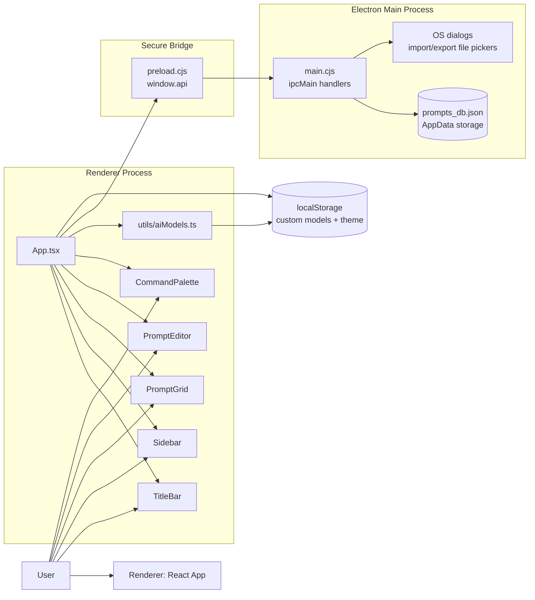
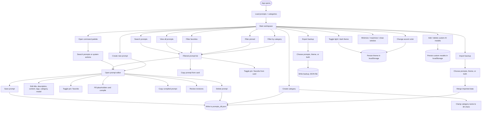
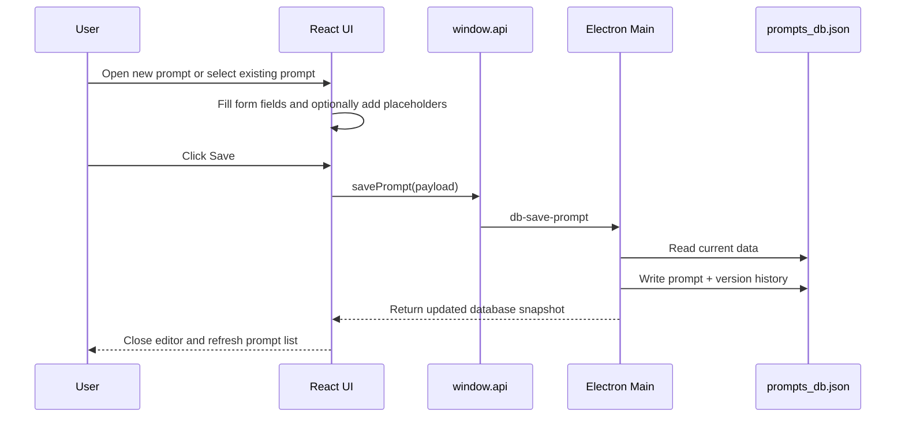
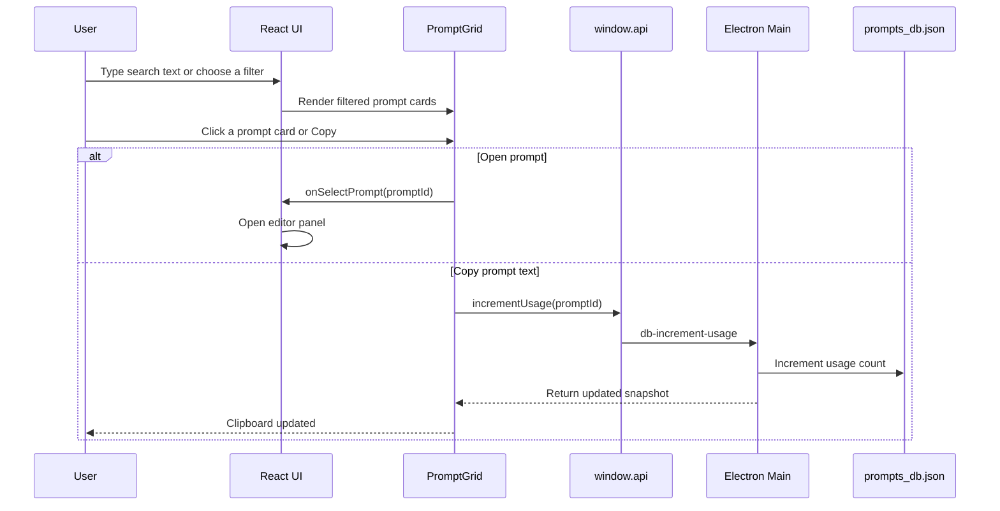
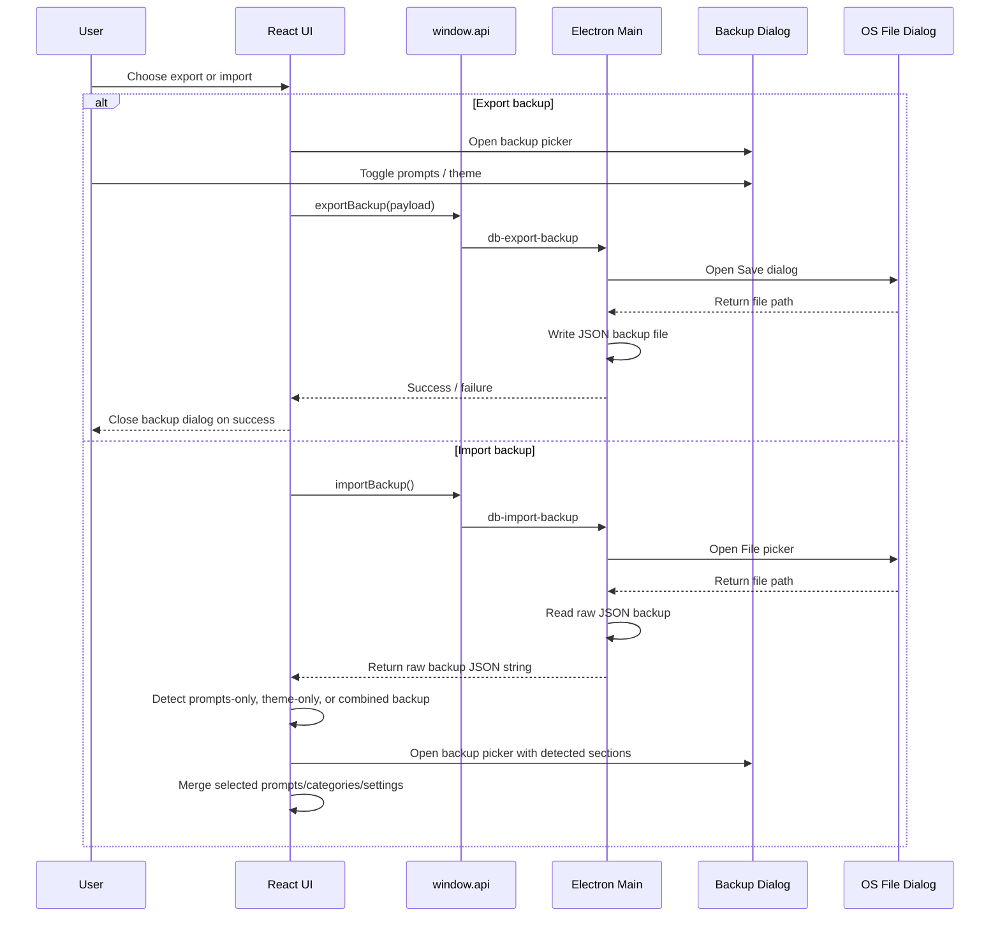

# PromptVault

PromptVault is a local-first Electron desktop app for managing AI prompts, categories, templates, version history, and workspace backups. The current implementation stores data in a JSON file under the Electron user data directory and exposes a safe renderer API through `preload.cjs`.

## What It Does

- Create, edit, delete, and save prompts.
- Pin and favorite prompts for quick filtering.
- Copy raw prompt text or compiled prompt output.
- Organize prompts by categories.
- Search by title, description, tags, content, and model.
- Maintain version history for each prompt.
- Manage theme mode, accent color, and custom AI models.
- Export and import prompts and theme data through an in-app backup picker.
- Enforce a 30-character maximum for new category names.

## Architecture Diagram



## User Flow Block Diagram



## Basic Sequence Diagrams

### 1. Create Or Edit Prompt



### 2. Search, Open, And Copy Prompt



### 3. Backup Export And Import



## Persistence Model

- Prompts and categories are persisted in `prompts_db.json` inside Electron `userData`.
- Theme mode and accent color are persisted in `localStorage`.
- Custom AI models are persisted in `localStorage` and synchronized across editor and title bar components.
- Backup files use a version 3 format with separate prompts and theme sections.
- Import no longer includes legacy backup compatibility.

## Project Scripts

- `npm run dev` - start the Vite renderer.
- `npm run electron:dev` - run the renderer and Electron together.
- `npm run build` - type-check and build the renderer.
- `npm run electron:build` - build the app and package it with Electron Builder.
- `npm run lint` - run ESLint.

## Implementation Notes

- `electron/main.cjs` owns window controls, database reads/writes, and backup import/export dialogs.
- `electron/preload.cjs` exposes the `window.api` surface used by the renderer.
- `src/App.tsx` orchestrates filtering, persistence, notifications, imports, exports, and editor state.
- `src/components/PromptEditor.tsx` handles prompt editing, template compilation, revision history, and custom model creation.
- `src/components/Sidebar.tsx` handles category filtering and backup actions.
- `src/components/PromptGrid.tsx` handles quick copy, pin, and favorite actions.
- `src/utils/aiModels.ts` manages preset and custom AI model persistence.

## Development

Install dependencies and start the desktop app with:

```bash
npm install
npm run electron:dev
```
