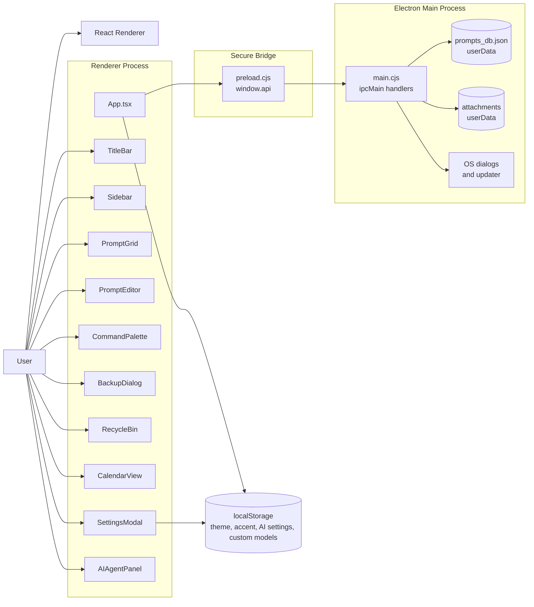
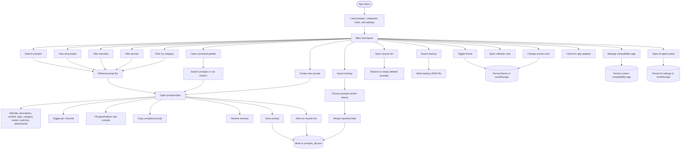

# PromptVault

PromptVault is a local-first Electron desktop app for managing AI prompts, categories, prompt switches, attachments, version history, trash recovery, workspace backups, and optional AI-assisted workflows. Prompt data lives in a JSON file under Electron user data, while theme, accent, compatibility tags, and AI settings use `localStorage` in the renderer.

## What It Does

- Create, edit, delete, restore, and permanently remove prompts.
- Pin and favorite prompts for quick filtering.
- Search by title, description, tags, content, category, and model.
- Compile prompt templates with placeholders and copy either raw or compiled output.
- Attach files to prompts and reopen saved attachments from the editor or grid.
- Manage categories, including the 30-character name limit enforced in the UI.
- Review prompt revision history.
- Open the recycle bin, calendar view, category dialog, settings modal, and AI agent panel from the main workspace.
- Switch theme mode and accent color.
- Add custom compatibility tags for model targeting.
- Configure AI assistant settings, including provider, API key, and optional local MCP server access.
- Export and import backups with selectable prompts and theme sections.
- Check GitHub releases and launch the downloaded installer from Settings.

## Architecture


```mermaid
flowchart LR
	U[User] --> A[React Renderer]
	subgraph Renderer[Renderer Process]
		App[App.tsx]
		TB[TitleBar]
		SB[Sidebar]
		PG[PromptGrid]
		PE[PromptEditor]
		CP[CommandPalette]
		BD[BackupDialog]
		RB[RecycleBin]
		CV[CalendarView]
		SM[SettingsModal]
		AI[AIAgentPanel]
	end

	subgraph Bridge[Secure Bridge]
		Preload[preload.cjs\nwindow.api]
	end

	subgraph Main[Electron Main Process]
		MainJS[main.cjs\nipcMain handlers]
		DB[(prompts_db.json\nuserData)]
		Attach[(attachments\nuserData)]
		Dlg[OS dialogs\nand updater]
	end

	U --> TB
	U --> SB
	U --> PG
	U --> PE
	U --> CP
	U --> BD
	U --> RB
	U --> CV
	U --> SM
	U --> AI
	App --> Preload
	Preload --> MainJS
	MainJS --> DB
	MainJS --> Attach
	MainJS --> Dlg
	SM --> L[(localStorage\ntheme, accent, AI settings, custom models)]
	App --> L
```

## User Flow


```mermaid
flowchart TD
	Start([App opens]) --> Load[Load prompts, categories, trash, and settings]
	Load --> Home[Main workspace]

	Home --> Search[Search prompts]
	Home --> FilterAll[View all prompts]
	Home --> FilterFav[Filter favorites]
	Home --> FilterPin[Filter pinned]
	Home --> FilterCat[Filter by category]
	Home --> Palette[Open command palette]
	Home --> NewPrompt[Create new prompt]
	Home --> ToggleTheme[Toggle theme]
	Home --> Accent[Change accent color]
	Home --> Models[Manage compatibility tags]
	Home --> AiPanel[Open AI agent panel]
	Home --> Trash[Open recycle bin]
	Home --> Calendar[Open calendar view]
	Home --> Import[Import backup]
	Home --> Export[Export backup]
	Home --> Updates[Check for app updates]

	Search --> Results[Filtered prompt list]
	FilterAll --> Results
	FilterFav --> Results
	FilterPin --> Results
	FilterCat --> Results
	Palette --> PaletteSearch[Search prompts or run actions]

	Results --> OpenPrompt[Open prompt editor]
	PaletteSearch --> OpenPrompt
	NewPrompt --> OpenPrompt

	OpenPrompt --> Edit[Edit title, description, content, tags, category, model, switches, attachments]
	OpenPrompt --> PinFav[Toggle pin / favorite]
	OpenPrompt --> Compile[Fill placeholders and compile]
	OpenPrompt --> CopyCompiled[Copy compiled prompt]
	OpenPrompt --> History[Review versions]
	OpenPrompt --> Save[Save prompt]
	OpenPrompt --> Delete[Move to recycle bin]

	Save --> Persist[(Write to prompts_db.json)]
	Delete --> Persist
	Trash --> Restore[Restore or empty deleted prompts]
	Import --> Pick[Choose prompts and/or theme]
	Pick --> Merge[Merge imported data]
	Merge --> Persist
	Export --> Write[Write backup JSON file]
	ToggleTheme --> ThemeState[(Persist theme in localStorage)]
	Accent --> ThemeState
	Models --> ModelState[(Persist custom compatibility tags)]
	AiPanel --> AiState[(Persist AI settings in localStorage)]
```

## Data And Storage

- Prompts, categories, and deleted prompts are stored in `prompts_db.json` inside Electron `userData`.
- Prompt attachments are stored under `userData/attachments`.
- Theme mode and accent color are stored under the `promptvault-theme-preferences` key in `localStorage`.
- Custom compatibility tags are stored under the `promptvault-custom-models` key in `localStorage` and broadcast through the `promptvault:custom-models-updated` event.
- AI assistant settings are stored in `localStorage` under `promptvault-ai-agent-settings`.
- Backups use version 3 payloads with `kind: promptvault-backup` and separate `prompts` and `theme` sections.

## Project Scripts

- `npm run dev` - start the Vite renderer.
- `npm run electron:dev` - run the renderer and Electron together.
- `npm run build` - type-check and build the renderer.
- `npm run electron:build` - build the app and package it with Electron Builder.
- `npm run lint` - run ESLint.

## Implementation Notes

- `electron/main.cjs` owns window controls, prompt persistence, attachment storage, backup import/export dialogs, and update handling.
- `electron/preload.cjs` exposes the renderer-safe `window.api` bridge.
- `src/App.tsx` coordinates filtering, prompt editing, import/export flows, trash, calendar, settings, notifications, and the AI agent panel.
- `src/components/PromptEditor.tsx` handles prompt editing, template compilation, version history, switches, and attachments.
- `src/components/PromptGrid.tsx` handles quick copy, pin, favorite, and attachment actions.
- `src/components/BackupDialog.tsx` drives prompt/theme backup selection and category selection.
- `src/components/RecycleBin.tsx` manages restore, permanent delete, and empty-trash actions.
- `src/components/SettingsModal.tsx` manages appearance, compatibility tags, AI settings, and release checks.
- `src/utils/aiModels.ts` manages preset and custom compatibility tag persistence.

## Development

Install dependencies and start the desktop app with:

```bash
npm install
npm run electron:dev
```
