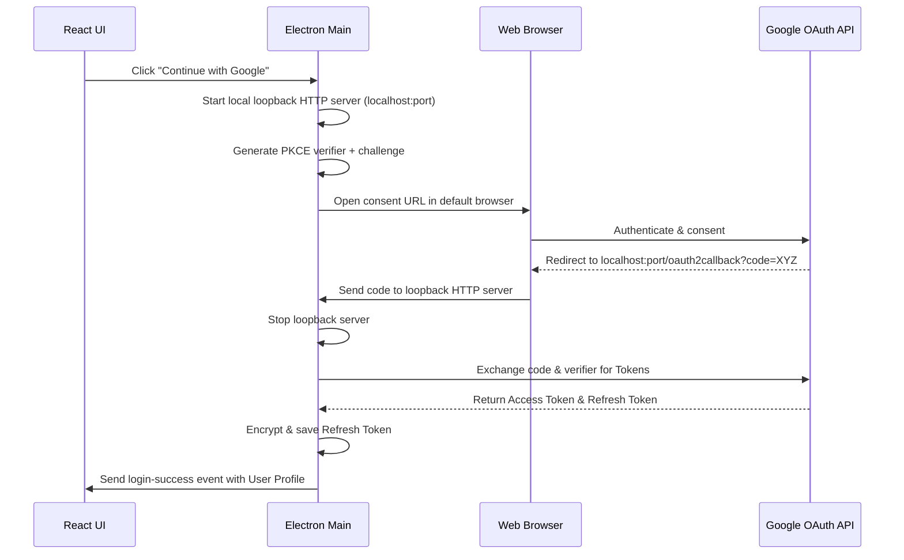

# Google Authentication & Drive Backup Plan (Serverless)

We can implement Google Sign-In and Google Drive backups entirely client-side within the Electron desktop application, with **zero external backend servers required**. 

This is achieved using **Google OAuth 2.0 for Desktop Applications** with a temporary loopback HTTP server and Google Drive's private **App Data Folder** (`appDataFolder`) space.

---

## User Review Required

> [!IMPORTANT]
> **Key Architecture Decisions**:
> 1. **Loopback Server Flow**: When the user clicks "Continue with Google", the Electron main process spawns a temporary HTTP server on a random local port (e.g., `http://localhost:52467`). It then opens the user's default web browser to Google's consent screen. Google redirects back to the loopback address, passing the authorization code.
> 2. **Private App Data Folder (`appDataFolder`)**: We will request the `https://www.googleapis.com/auth/drive.appdata` scope. This gives our app access to a private, hidden folder on the user's Drive. Files stored here count toward the user's storage quota but are invisible to them in the general Drive UI, protecting the database from accidental deletion or manual edits.
> 3. **Secure Encryption on Windows**: Authentication credentials (refresh and access tokens) will be encrypted locally using Electron's `safeStorage` API before saving them to disk (in `credentials.json` inside the user AppData folder). On Windows, `safeStorage` uses DPAPI, ensuring the keys cannot be decrypted by other users or processes.

---

## Proposed Changes

### Electron Main Process

#### [MODIFY] [main.cjs](file:///d:/projects/work/electron/main.cjs)
- **OAuth Loopback Manager**: Implement a helper to start a temporary HTTP server, generate a PKCE `code_verifier` and `code_challenge`, construct the login URL, open it via `shell.openExternal`, exchange the code for tokens, and terminate the server.
- **Secure Credentials Storage**: Store tokens encrypted via `safeStorage.encryptString`.
- **Google API Client Helpers**:
  - `fetchUserProfile()`: Obtains profile info (name, email, picture url).
  - `syncToGoogleDrive()`: Finds or updates the `promptvault_backup.json` inside the `appDataFolder`.
- **IPC Handler Additions**:
  - `auth-login-google`: Starts loopback login process.
  - `auth-logout`: Deletes tokens and resets auth state.
  - `auth-get-profile`: Returns user info (or null if not logged in).
  - `auth-toggle-sync`: Updates the sync toggle and forces a database upload if toggled on.

#### [MODIFY] [preload.cjs](file:///d:/projects/work/electron/preload.cjs)
- Expose the new authentication IPC handlers to the React frontend.

---

### React Frontend

#### [NEW] [src/components/UserProfile.tsx](file:///d:/projects/work/src/components/UserProfile.tsx)
- Create a premium glassmorphic dropdown/profile panel shown next to the Theme Studio.
- Displays Google profile avatar, user name, and email address.
- Provides a clean toggle switch to enable/disable "Auto-Sync to Google Drive".
- Displays the timestamp of the last successful backup.

#### [MODIFY] [src/components/TitleBar.tsx](file:///d:/projects/work/src/components/TitleBar.tsx)
- Integrate the sign-in button or user profile avatar into the top bar.
- Clicking the profile avatar opens the new `UserProfile` dropdown panel.

#### [MODIFY] [src/App.tsx](file:///d:/projects/work/src/App.tsx)
- Coordinate auth and sync status.
- Trigger `syncToGoogleDrive` automatically in the background whenever a prompt or category is saved/deleted.

---

## Technical Details

### 1. Loopback Authentication Flow (PKCE)


### 2. Google Drive App Folder File Metadata
We will query and write a file named `promptvault_backup.json` containing the database and configuration:
```json
{
  "backupVersion": 1,
  "timestamp": 1717519200000,
  "theme": {
    "mode": "dark",
    "accent": "#8B5CF6"
  },
  "data": {
    "categories": [...],
    "prompts": [...]
  }
}
```

---

## Verification Plan

### Automated Tests
- Run `npm run build` to verify typing integration.

### Manual Verification
1. Launch app with `npm run electron:dev`.
2. Click "Sign In with Google" and verify browser redirection.
3. Complete sign-in, confirm browser closes/shows success page, and profile displays name/avatar inside PromptVault.
4. Toggle "Auto-Sync" to upload a test prompt.
5. Verify (via Chrome DevTools or log checks) that the file is written to `appDataFolder`.
6. Restart application and verify auto-login using the encrypted local token.

---

## Detailed Implementation (completed)

### IPC Contracts (Main <-> Renderer)
- `auth-login-google` (invoke): starts loopback OAuth flow. Returns `{ success: boolean, profile?: { name, email, avatar }, error?: string }`.
- `auth-logout` (invoke): removes local encrypted credentials and returns `{ success: boolean }`.
- `auth-get-profile` (invoke): returns `{ profile: { name, email, avatar } | null, synced: boolean, lastBackupTs?: number }`.
- `auth-toggle-sync` (invoke, body `{ enabled: boolean }`): enables/disables auto-sync and returns `{ success: boolean }`.
- `auth-event` (send): server -> renderer events for `login-success`, `login-failed`, `sync-progress`, `sync-complete`, `sync-error`.

### Main process helpers (pseudocode & notes)
- PKCE generation: generate `code_verifier` (random 64 chars) and `code_challenge = base64url(SHA256(code_verifier))`.
- Start a temporary HTTP server on localhost:randomPort and open consent URL constructed as:
  - `https://accounts.google.com/o/oauth2/v2/auth?client_id=<CLIENT_ID>&response_type=code&scope=https://www.googleapis.com/auth/drive.appdata%20openid%20email%20profile&redirect_uri=http://127.0.0.1:<PORT>/oauth2callback&code_challenge=<CHALLENGE>&code_challenge_method=S256&access_type=offline&prompt=consent`
- Exchange authorization code for tokens at `https://oauth2.googleapis.com/token` with `grant_type=authorization_code`, `code_verifier`, and client info.
- Persist tokens encrypted using `safeStorage.encryptString(JSON.stringify({ refresh_token, expiry, scope }))` to `credentials.json` inside `app.getPath('userData')`.
- On startup, attempt silent refresh using stored refresh token by POST to `https://oauth2.googleapis.com/token` with `grant_type=refresh_token`.

### Storage format (credentials)
`credentials.json` (binary encrypted blob written to disk after `safeStorage.encryptString`):

```json
{
  "version": 1,
  "encrypted": "<base64-encrypted-bytes>"
}
```

After decryption the payload is:
```json
{
  "refresh_token": "...",
  "scopes": ["https://www.googleapis.com/auth/drive.appdata"],
  "last_refresh": 1717519200000
}
```

### Google Drive helpers
- `fetchUserProfile(accessToken)`: GET `https://www.googleapis.com/oauth2/v3/userinfo` with `Authorization: Bearer <accessToken>` and return `{ name, email, picture }`.
- `syncToGoogleDrive(accessToken, backupPayload)`:
  - Use Drive API `files.list` with `spaces=appDataFolder` and `q=name='promptvault_backup.json'` to locate file.
  - If exists: `files.update` with `media` upload (multipart/ resumable) and update `modifiedTime`.
  - If not: `files.create` in `appDataFolder` with `name: 'promptvault_backup.json'` and the JSON payload.

### Error handling & UX
- If encryption/decryption via `safeStorage` fails (platform unsupported), fall back to storing a user-visible warning and keep tokens in-memory only (do not write unencrypted refresh tokens to disk).
- Provide clear UI states: `Signed out`, `Signing in…`, `Signed in (Auto-sync ON/OFF)`, `Sync in progress (percent)`.

### Frontend components & integration notes
- `src/components/UserProfile.tsx`: minimal props -> calls `window.api.invoke('auth-get-profile')` on mount; exposes a toggle bound to `auth-toggle-sync` and buttons for `auth-login-google` / `auth-logout`.
- `src/components/TitleBar.tsx`: show `Sign in` button when no profile; show avatar when signed in. Clicking avatar opens the `UserProfile` dropdown.
- `src/App.tsx`: subscribe to `auth-event` for `login-success` and `sync-*` events; when local DB changes (save/delete) and auto-sync enabled, debounce and call `auth-toggle-sync`/`syncToGoogleDrive` via an IPC invoke (new channel `auth-run-sync`).

### Security & privacy
- Use `access_type=offline` and `prompt=consent` to ensure `refresh_token` is returned during the first auth.
- Scope limited to `drive.appdata` plus `openid email profile` for user identity only.
- Never log raw tokens. Any errors that contain token material must be scrubbed before writing to logs.

### Migration & Rollout
- Existing users without cloud credentials: default to signed-out. Provide a one-time onboarding banner explaining what `Auto-Sync` does.
- Provide a small migration utility if a future version changes backup schema: include `backupVersion` in the JSON and run a transform during `syncToGoogleDrive`.

### Manual verification (expanded)
1. Start dev server: `npm run electron:dev` and open console logs.
2. Click "Sign in with Google" — browser consent should open. Complete consent.
3. Confirm renderer receives `login-success` with profile and avatar appears in UI.
4. Enable `Auto-Sync` and create or edit a prompt; confirm `sync-progress` events and `sync-complete` are emitted.
5. Inspect Drive (using Drive API Explorer with same account or programmatic check) to confirm `promptvault_backup.json` exists in `appDataFolder`.
6. Restart app; verify silent refresh succeeds and profile loads without interactive login.

### Next steps (implementation order)
1. Implement loopback + PKCE + token storage in `electron/main.cjs`.
2. Add Drive helpers and `auth-run-sync` channel.
3. Expose IPC in `electron/preload.cjs`.
4. Implement `UserProfile` component and wire into `TitleBar`.
5. Add debounce + auto-sync triggers in `src/App.tsx`.
6. Test flows, fix UX edge-cases, and write docs for admin/testing.

